# DevOps Course project
This project is a practical DevOps training exercise, designed to showcase how to develop, containerize, and deploy a full-stack JavaScript application in multiple environments.
It combines:
- Backend: Node.js + Express serving a JSON file (notes.json) via a REST API at /api/notes.
- Frontend: React app consuming this backend API.
- Containerization: Docker + Docker Compose.
- Deployment: Runs locally, in local Docker, and on a remote Azure VM using Docker Compose.
Built to be easily run:
- Locally with npm
- In Docker (Mac or Windows)
- On a remote VM (Azure) using Docker Compose

---

## Technology stack
| Layer      | Technology              | Purpose                                   |
| ---------- | ----------------------- | ----------------------------------------- |
| Backend    | Node.js + Express       | Serves JSON data as REST API              |
| Frontend   | React                   | UI consuming backend API                  |
| Web server | Nginx                   | Serves React static files + reverse proxy |
| Containers | Docker + Docker Compose | Isolated reproducible environments        |
| Cloud      | Azure VM (Ubuntu)       | Production-like deployment                |

---

## How to run in different environments

### 1. Local development (directly on your machine)
Run backend:
- cd backend
- npm install
- node index.js
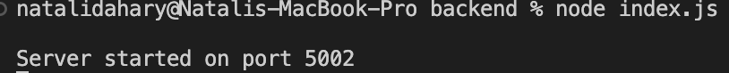

- Runs on http://localhost:5002
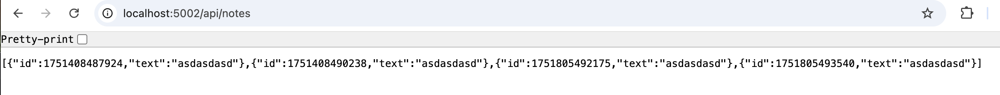

Run frontend:
- cd frontend
- npm install
- npm start
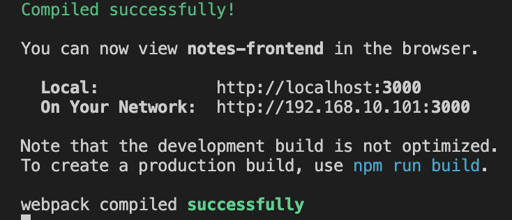

- Opens http://localhost:3000
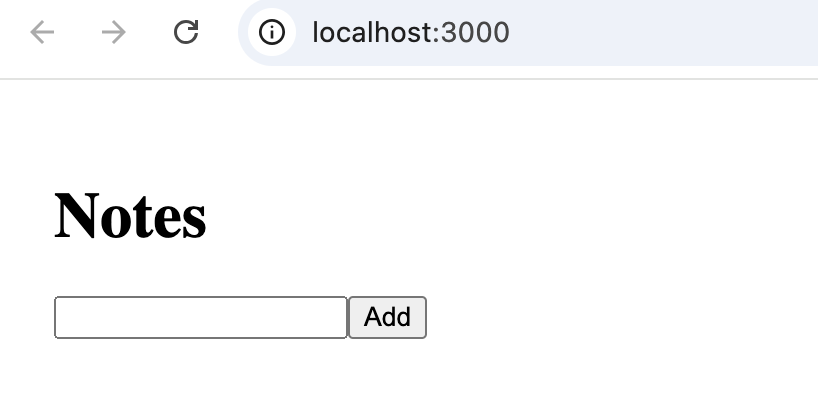

- Proxies API requests to http://localhost:5002

---

### 2. Local Docker (on Mac)
Builds Docker images for:
- Frontend: multi-stage build with React + Nginx
- Backend: Node.js image
- Starts containers defined in docker-compose.yml.
Nginx configuration (for frontend Docker image):
- The frontend uses a custom nginx.conf
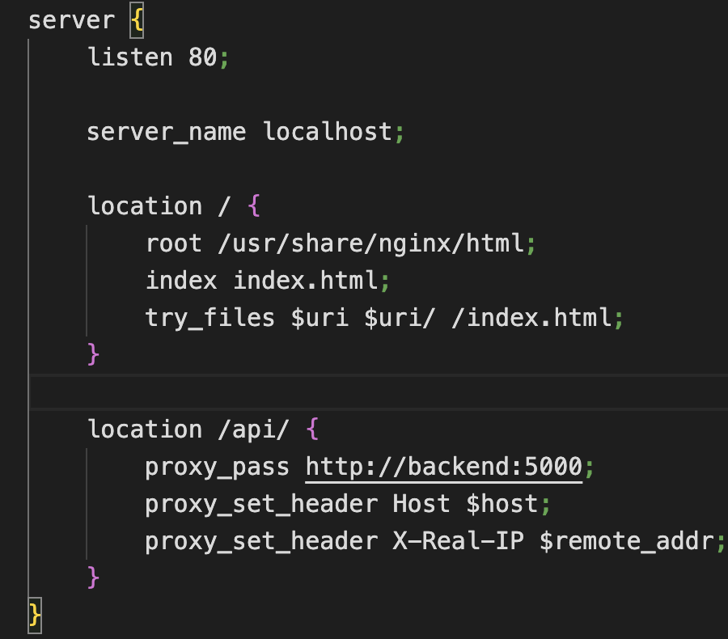

This allows:
- Serving the React app at /
- Proxying API requests /api/* to the backend service in Docker Compose.
- Build & start containers:
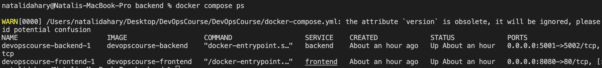

- docker compose up -d
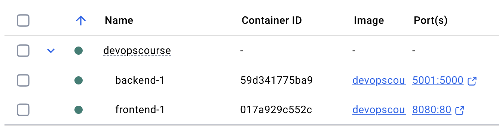
Access:

- Frontend: http://localhost:8080
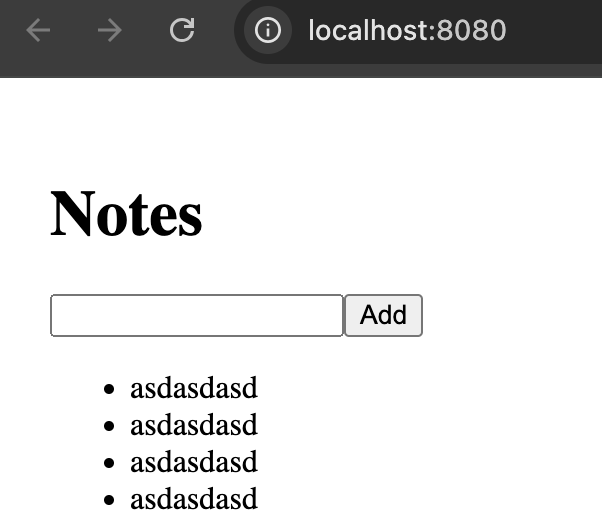

- Backend: http://localhost:5001/api/notes

Stop:
- docker compose down

Instead of running docker build + docker push by hand, you can use:
- ./build-and-push.sh
- Build images of FE and BE locally and push to Docker Hub by script.
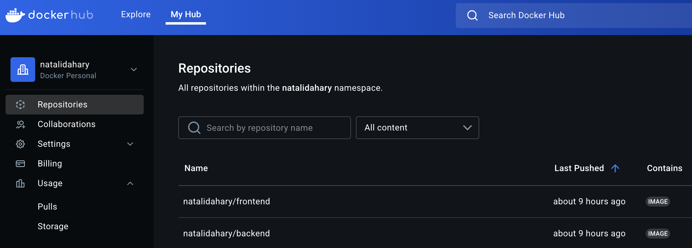

---

### 3. On Azure VM (Docker Compose)

Connect to VM:

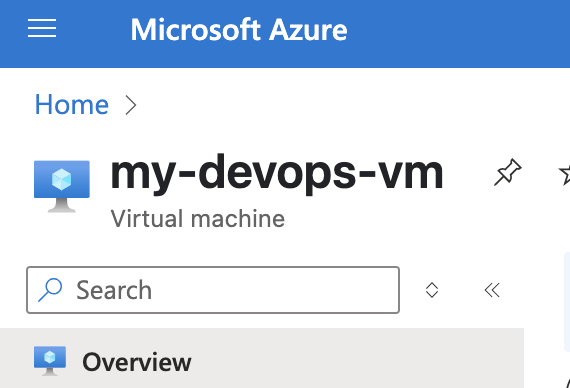
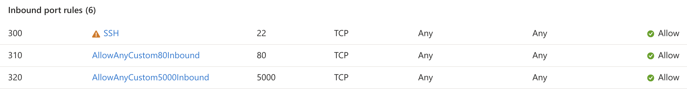

- chmod 400 /path/my-devops-vm_key.pem
- ssh -i path/to/key.pem azureuser@<VM_IP>
- creating a docker-compose.yml file on VM.
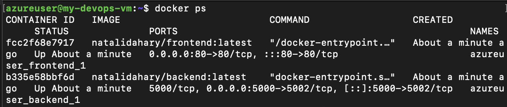

Pull & run containers:
- docker-compose up -d
Access:
- Frontend: http://<VM_IP>/
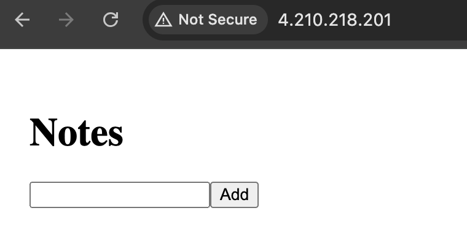

- Backend API direct: http://<VM_IP>:5000/api/notes
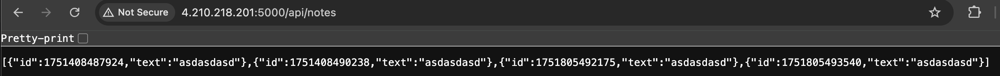

Stop:
- docker-compose down
