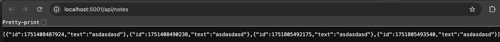

# DevOps Course project
This project is a practical DevOps exercise, showing how to develop, containerize, deploy, and automate a full-stack JavaScript app across local, Docker, and cloud environments — with GitHub Actions CI/CD.

**It combines:**
- Backend: Node.js + Express serving a JSON file (notes.json) via a REST API at /api/notes.
- Frontend: React app consuming this backend API.
- Containerization: Docker + Docker Compose.
- Deployment: Runs locally, in local Docker, and on a remote Azure VM using Docker Compose.

**Built to be easily run:**
- Locally with npm
- In Docker (Mac or Windows)
- On a remote VM (Azure) using Docker Compose

---

## Technology stack
| Layer      | Technology              | Purpose                                   |
| ---------- | ----------------------- | ----------------------------------------- |
| Backend    | Node.js + Express       | Serves JSON data as REST API              |
| Frontend   | React                   | UI consuming backend API                  |
| Web server | Nginx                   | Serves React static files + reverse proxy |
| Containers | Docker + Docker Compose | Isolated reproducible environments        |
| Cloud      | Azure VM (Ubuntu)       | Production-like deployment                |
| CI/CD      | GitHub Actions          | Build, push images & deploy automatically |

## Ports Table

| Service  | Container Port | Host Port (Local) | Host Port (Azure VM) | Purpose                              |
| -------- | -------------- | ----------------- | -------------------- | ------------------------------------ |
| Backend  | `5002`         | `5001`            | `5000`               | Express app serving API `/api/notes` |
| Frontend | `80`           |  `80`             | `80`                 | Nginx serving React app              |

---

## How to run in different environments

### 1. Local development (directly on your machine)
**Run backend:**
- cd backend
- npm install
- node index.js

- Runs on http://localhost:5002/api/notes

**Run frontend:**
- cd frontend
- npm install
- npm start

- Opens http://localhost:3000

- Proxies API requests to http://localhost:5002/api/notes

---

### 2. Local Docker (on Mac)
**Builds Docker images for:**
- Frontend: multi-stage build with React + Nginx
- Backend: Node.js image
- Starts containers defined in docker-compose.yml.

**Nginx configuration (for frontend Docker image):**
- The frontend uses a custom nginx.conf

**This allows:**
- Serving the React app at /
- Proxying API requests /api/* to the backend service in Docker Compose.
- Build & start containers:

- docker compose up -d

**Access:**
- Frontend: http://localhost:80

- Backend: http://localhost:5001/api/notes

**Stop:**
- docker compose down

**Instead of running docker build + docker push by hand, you can use:**
- ./build-and-push.sh

- Build images of FE and BE locally and push to Docker Hub by script.

---

### 3. On Azure VM (Docker Compose)

**Connect to VM:**

- chmod 400 /path/my-devops-vm_key.pem
- ssh -i path/to/key.pem azureuser@<VM_IP>
- creating a docker-compose.yml file on VM.

**Pull & run containers:**
- docker-compose pull
- docker-compose up -d

**Access:**
- Frontend: http://<VM_IP>/

- Backend API direct: http://<VM_IP>:5000/api/notes

**Stop:**
- docker-compose down

### 4. Automated CI/CD with GitHub Actions
**On push to main, or on manual trigger from GitHub Actions UI:**

- **CI:** Runs npm install, lint, build checks on backend & frontend.

- **CD:** Builds Docker images, pushes to Docker Hub.

- **Deploy:** SSH into Azure VM, pulls new images, runs docker-compose up -d.

**How to manually trigger workflow:**
**Go to your GitHub repo → Actions tab → select your workflow → click Run workflow.**

**Setup GitHub repository secrets:**
You needed to securely store sensitive info, so you created secrets in your repo under
**Settings → Secrets and variables → Actions → New repository secret**.

| Name                  | Value                                               |
| --------------------- | --------------------------------------------------- |
| `DOCKER_HUB_USERNAME` | Your Docker Hub username                            |
| `DOCKER_HUB_TOKEN`    | Docker Hub access token or password                 |
| `VM_HOST`             | Public IP of your Azure VM (like `4.210.218.201`)   |
| `VM_SSH_KEY`          | Contents of your `my-devops-vm_key.pem` private key |

**Created workflow file(s):**

**.github/workflows/ci.yml**
- Runs npm ci, npm run lint, and npm test on backend & frontend.
**.github/workflows/deploy-to-vm.yml**
- SSH into Azure VM, runs docker-compose pull && up -d to deploy latest.
**.github/workflows/cd-build-push.yml**
- Builds multi-stage Docker images, pushes to Docker Hub.

**CI pipeline steps (Continuous Integration):**
- Runs on every push or PR to main branch.

| What it does                 | Why                               |
| ---------------------------- | --------------------------------- |
| `npm ci` and `npm run build` | Ensures app builds cleanly        |
| Optionally runs lint / tests | Catch bugs early                  |
| Runs on clean VM (runner)    | No leftover state from old builds |

**CD pipeline steps (Continuous Delivery / Deployment):**
- Triggered on main push, or manually from Actions UI.

| What it does                                        | Why                            |
| --------------------------------------------------- | ------------------------------ |
| Builds Docker images for frontend & backend         | Ensures up-to-date containers  |
| Logs in to Docker Hub using secrets                 | Push images to Docker Hub      |
| Uses `docker buildx` for multi-platform builds      | Consistent image builds        |
| SSH into Azure VM via your private key (in secrets) | Executes remote commands       |
| Runs `docker-compose pull` & `docker-compose up -d` | Pulls latest images & restarts |

- This means you never have to SSH & deploy manually.
- Just git push → GitHub does everything → Azure is updated.

